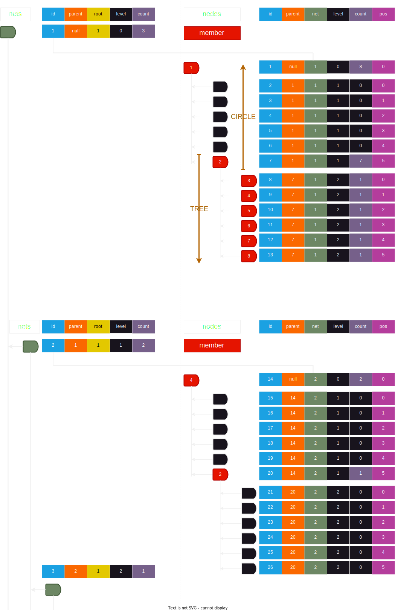

# Технічні деталі

## Технічні вимоги

| етап | кількість користувачів | кількість спільнот | max рівень в спільноті | max рівень підспільнот |
|------|-----------------------:|-------------------:|-----------------:|-----------------------------:|
|  1   |                    500 |   10               | 4                | 3                            |
|  2   |                  2 000 |  100               | 8                |                              |
|  3   |                 20 000 | 1000               |                  |                              |
|  4   |                200 000 |                    |                  |                              |
|  5   |              2 000 000 |                    |                  |                              |
|  6   |            100 000 000 |                    |                  |                              |
|  7   |          1 000 000 000 |                    |                  |                              |
|  8   |          5 000 000 000 |                    |                  |                              |

Приклад розрахунку для спільноти з максимальним рівнем 4.

| рівень                    | 0     | 1     | 2     | 3     | 4     |
|---------------------------|-------|-------|------:|------:|------:|
| кратність                 | 6     | 6     | 6     | 6     | 0     |
| кількість учасників рівня | 1     | 6     | 36    | 216   | 1 296 |
| загальна к-ть учасників   | 1     | 7     | 43    | 259   | 1 555 |

## Код

## Стек

## Структура спільноти

---

## [DB](db.md)

## Структура проекту

## API
